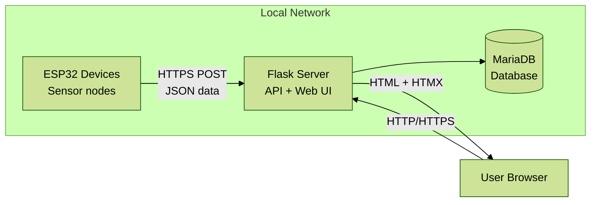

# Local Feather — Simplified Design Document

## Design Philosophy

**Start simple. Grow intentionally.**

This design prioritizes:
1. **Ease of installation** for non-technical users
2. **Minimal resource usage** on Raspberry Pi
3. **Clear debugging** when things go wrong
4. **Obvious growth paths** when features are needed

We explicitly reject over-engineering. Every component must justify its complexity cost.

## Overview

Local Feather collects sensor data from ESP32 Feather devices and stores it on a local server (Raspberry Pi, Linux VM, or Windows). The entire system operates on the local network without requiring internet access.

**Key constraint**: Installable and maintainable by non-technical users.

## Goals

- Reliable local sensor data collection and storage
- Support multiple sensor types with easy extensibility
- Simple installation: one command or Docker Compose
- Minimal resource footprint on Raspberry Pi
- Clear web interface for monitoring and configuration
- Secure communication with minimal certificate complexity
- Robustness against network interruptions

## High-Level Architecture



**That's it.** Three components:
1. ESP32 devices
2. Flask server
3. MariaDB database (SQLite fallback for development)

No MQTT broker. No reverse proxy. No separate frontend build. No microservices.

## Architecture Details

### Component Stack

| Component | Technology | Why This Choice | Growth Path |
|-----------|-----------|-----------------|-------------|
| **Backend** | Flask 3.x + Gunicorn | Simple, proven, extensive ecosystem | Add Flask-RESTX for API docs if needed |
| **Database** | MariaDB 10.5+ | Free, performant, MySQL-compatible, handles concurrent writes well | Add replication/clustering for HA |
| **Dev Database** | SQLite (optional) | Quick local development without MariaDB | Production uses MariaDB |
| **Web UI** | Jinja2 + HTMX + Tailwind CSS | No build pipeline, modern UX | Add Alpine.js for complex interactions |
| **Charts** | Chart.js | Mature, works in templates | Upgrade to more advanced viz if needed |
| **Auth** | Flask-Login + Flask-Bcrypt | Simple session-based auth | Add Flask-Security-Too for advanced RBAC |
| **Migrations** | Flask-Migrate (Alembic) | Standard Flask pattern | No alternative needed |
| **ESP32 Firmware** | Arduino/PlatformIO | Familiar, well-documented | ESP-IDF for advanced features |
| **Communication** | HTTPS POST (JSON) | Simple, debuggable | Add MQTT later if bidirectional needed |
| **Deployment** | Docker Compose + install script | Easy setup, portable | Add Kubernetes if enterprise scale |

### Why These Choices?

**Flask over FastAPI/Django**:
- Simpler than FastAPI (no async complexity for this scale)
- More flexible than Django (we don't need all the batteries)
- Huge ecosystem of extensions for growth
- Perfect for 5-20 devices with 1 req/min each

**HTMX over React**:
- No Node.js, webpack, or build pipeline
- No CORS complexity
- No state management libraries
- Modern dynamic UX with server-rendered HTML
- One codebase (Python) instead of two (Python + JavaScript)

**MariaDB over PostgreSQL**:
- MySQL-compatible (familiar to most users)
- Excellent performance for time-series data
- Better concurrent write handling than SQLite
- Built-in replication for growth
- Free and truly open source (GPL)
- Widely packaged for Raspberry Pi/Linux

**SQLite for Development**:
- Optional for quick local testing
- No server setup needed
- Production deployments use MariaDB
- Same SQLAlchemy code works for both

**Direct HTTPS over MQTT**:
- One less service to install/configure
- Easier debugging (standard HTTP tools)
- ESP32 needs HTTPS for OTA anyway
- Simpler certificate management
- MQTT adds value at 50+ devices, not 5-20

## Detailed Component Design

### ESP32 Firmware

**Core functionality**:
```
WiFiManager → Connect to WiFi → Read Sensors → POST to Server → Sleep/Repeat
```

**Libraries**:
- **WiFiManager**: Captive portal for initial setup (proven, simple)
- **HTTPClient**: HTTPS POST for sending data
- **ArduinoJson**: JSON serialization
- **ESP32HTTPUpdate**: OTA firmware updates
- **Preferences**: Store server URL and API key in NVS

**Data flow**:
1. On first boot: Start captive portal (AP mode)
2. User connects, enters WiFi credentials + server URL + API key
3. Device connects to WiFi, registers with server
4. Every N seconds: Read sensors, POST JSON to `/api/readings`
5. On failure: Retry with exponential backoff (3 attempts, then wait 5 min)
6. Periodically check `/api/ota/check` for firmware updates

**Memory footprint**: <60KB RAM (WiFi stack + TLS + JSON)

**No persistent buffering**: If network is down, data is lost. Trade-off: simpler firmware, faster development. Growth path: add LittleFS buffering in v2 if users need it.

**Example POST payload**:
```json
{
  "device_id": "esp32-sensor-01",
  "api_key": "device-secret-key-here",
  "readings": [
    {
      "sensor": "temperature",
      "value": 23.5,
      "unit": "C",
      "timestamp": 1234567890
    },
    {
      "sensor": "humidity",
      "value": 65.2,
      "unit": "%",
      "timestamp": 1234567890
    }
  ]
}
```

### Flask Server

**Architecture** (Clean Architecture lite):
```
routes/        # HTTP endpoints (Flask blueprints)
services/      # Business logic
models/        # SQLAlchemy models
templates/     # Jinja2 HTML templates
static/        # CSS, JS, images
utils/         # Helpers (auth, validation)
```

**Key blueprints**:
- `api/`: Device endpoints (`/api/readings`, `/api/ota/check`)
- `web/`: User-facing pages (dashboard, device management, settings)
- `auth/`: Login, logout, user management

**Database models**:

```python
# Device model
class Device(db.Model):
    id = Integer (primary key)
    device_id = String (unique, indexed)
    name = String
    api_key = String (hashed)
    firmware_version = String
    last_seen = DateTime
    status = String (enum: active, offline, error)
    created_at = DateTime

# Sensor model (allows dynamic sensor types)
class Sensor(db.Model):
    id = Integer (primary key)
    device_id = ForeignKey(Device)
    sensor_type = String (e.g., "temperature", "humidity")
    unit = String
    last_value = Float (denormalized for quick dashboard)
    last_reading_at = DateTime

# Reading model (time-series data)
class Reading(db.Model):
    id = Integer (primary key, autoincrement)
    device_id = ForeignKey(Device)
    sensor_type = String (indexed)
    value = Float
    unit = String
    timestamp = DateTime (indexed)
    received_at = DateTime (server receipt time)

# User model (for web UI access)
class User(db.Model):
    id = Integer (primary key)
    username = String (unique)
    password_hash = String (bcrypt)
    role = String (enum: admin, viewer)
    created_at = DateTime
```

**Indexes**:
- `readings.timestamp` (for time-range queries)
- `readings.device_id, timestamp` (composite, for per-device charts)
- `devices.device_id` (for API lookups)

**Data retention** (future enhancement):
- Keep raw readings for 90 days
- After 90 days, downsample to hourly averages (stored in `aggregated_readings` table)
- Keep aggregates for 2 years
- Automatic cleanup via scheduled job (APScheduler or systemd timer)

### Web UI

**Tech stack**:
- **Jinja2**: Server-rendered templates
- **HTMX**: Dynamic updates without JavaScript frameworks
- **Tailwind CSS**: Utility-first styling (via CDN for simplicity)
- **Chart.js**: Time-series line charts embedded in templates

**Key pages**:

1. **Dashboard** (`/`)
   - Latest readings from all devices (table)
   - Status indicators (online/offline)
   - Recent alerts
   - HTMX auto-refresh every 10 seconds

2. **Device Details** (`/devices/<device_id>`)
   - Time-series charts (last 24h, 7d, 30d)
   - Current readings
   - Device info (firmware version, last seen)
   - Actions: rename, delete, trigger OTA

3. **Devices List** (`/devices`)
   - All registered devices
   - Status, last seen, quick stats
   - Add new device (generates API key)

4. **Settings** (`/settings`)
   - User management (admin only)
   - Data retention policy
   - Backup/restore
   - System info (disk usage, database size)

5. **Data Export** (`/export`)
   - Select device, sensor, date range
   - Download CSV or JSON

**HTMX examples**:

Auto-refresh dashboard:
```html
<div hx-get="/dashboard/latest" hx-trigger="every 10s" hx-swap="innerHTML">
  <!-- Latest readings table rendered here -->
</div>
```

Inline device rename:
```html
<form hx-post="/devices/{{ device.id }}/rename" hx-target="#device-name">
  <input type="text" name="name" value="{{ device.name }}">
  <button>Save</button>
</form>
```

### Authentication & Security

**Web UI Authentication**:
- Flask-Login session-based auth
- Username + password (bcrypt hashed)
- Two roles: **admin** (full access), **viewer** (read-only)
- Login page with "Remember Me" option
- Session timeout: 7 days with activity

**Device Authentication**:
- Each device has a unique API key (generated on registration)
- API key sent in every POST request (JSON body)
- Server validates before accepting data
- API keys stored hashed in database

**HTTPS/TLS**:
- **Default**: HTTP-only (acceptable for local networks)
- **Optional**: HTTPS via self-signed certificate
- Documentation provides:
  - How to generate self-signed cert (OpenSSL one-liner)
  - How to accept cert in browser
  - How to configure ESP32 to skip cert validation (local network only)

**Future**: Option to use Let's Encrypt if server is exposed to internet (via Caddy as reverse proxy).

### OTA Updates

**Flow**:
1. Admin uploads new firmware.bin to server via web UI
2. Server stores file in `ota/` directory with version metadata
3. ESP32 periodically GETs `/api/ota/check` with current firmware version
4. Server responds with new version info if available
5. ESP32 downloads firmware from `/api/ota/download/<version>`
6. ESP32 verifies, installs, reboots

**Safety**:
- Firmware files validated (size, basic header check)
- ESP32 validates download before install
- If OTA fails, ESP32 rollback to previous version (built-in ESP32 feature)

**Version format**: Semantic versioning (e.g., `1.2.3`)

### Data Aggregation Strategy

**Problem**: Dashboard showing "Last 7 days" chart will scan 10,080 rows per sensor (1 reading/min × 7 days)

**Solution** (implemented when needed):
- Background job runs hourly (APScheduler)
- Aggregates readings from previous hour into `hourly_stats` table
- Stores: min, max, avg, count per sensor per hour
- Charts use raw data for <24h, hourly aggregates for >24h
- Significant performance improvement for long time ranges

**Database size management**:
- At 10 devices × 5 sensors × 1 reading/min: ~500KB/day, ~180MB/year
- MariaDB handles this easily with proper indexing
- Automatic cleanup jobs for old data
- InnoDB storage engine with automatic optimization

## Communication Protocol

### Device → Server

**Endpoint**: `POST /api/readings`

**Request**:
```json
{
  "device_id": "esp32-sensor-01",
  "api_key": "secret-key",
  "readings": [
    {
      "sensor": "temperature",
      "value": 23.5,
      "unit": "C",
      "timestamp": 1234567890
    }
  ]
}
```

**Response** (success):
```json
{
  "status": "ok",
  "received": 2
}
```

**Response** (error):
```json
{
  "status": "error",
  "message": "Invalid API key"
}
```

**Error handling**:
- 200: Success
- 401: Invalid API key (device should not retry)
- 429: Rate limited (device should back off)
- 500: Server error (device should retry with backoff)

### Server → Device (OTA)

**Check endpoint**: `GET /api/ota/check?device_id=X&version=1.0.0`

**Response**:
```json
{
  "update_available": true,
  "version": "1.1.0",
  "url": "/api/ota/download/1.1.0",
  "size": 1024000,
  "checksum": "sha256-hash"
}
```

## Network Resilience

**ESP32 behavior on failure**:
1. First failure: Retry immediately
2. Second failure: Wait 30 seconds, retry
3. Third failure: Wait 5 minutes, retry
4. Continue with 5-minute intervals until success
5. After 24 hours offline: Reboot and start fresh

**No persistent buffering in v1**: Data is lost if network is down. Acceptable trade-off for simplicity. Most sensor applications can tolerate occasional data gaps.

**Growth path**: Add LittleFS circular buffer in firmware v2 if users need guaranteed delivery.

## Deployment Options

### Option 1: Docker Compose (Recommended)

**Files**:
- `docker-compose.yml`
- `.env.example` (copy to `.env`)
- `Dockerfile`

**Setup**:
```bash
git clone <repo>
cd localfeather
cp .env.example .env
# Edit .env with desired settings
docker-compose up -d
```

**Accesses**:
- Web UI: `http://localhost:5000`
- API: `http://localhost:5000/api`

**Data persistence**: MariaDB database and uploads stored in Docker volumes.

**Benefits**: Works on any OS with Docker, easy updates, clean isolation.

### Option 2: Install Script (Raspberry Pi / Linux)

**Script**: `install.sh`

**What it does**:
1. Checks for Python 3.9+
2. Creates virtual environment
3. Installs dependencies from `requirements.txt`
4. Runs database migrations
5. Creates systemd service
6. Enables service to start on boot
7. Creates first admin user

**Usage**:
```bash
curl -sSL https://raw.githubusercontent.com/.../install.sh | bash
# Or download and inspect first:
wget https://raw.githubusercontent.com/.../install.sh
chmod +x install.sh
./install.sh
```

**Post-install**:
- Service runs on port 5000
- Access via `http://raspberrypi.local:5000` or `http://<IP>:5000`
- Logs: `journalctl -u localfeather -f`

**Benefits**: Native installation, no Docker overhead, easy for Raspberry Pi users.

## Development Workflow

### Local Development

**Backend**:
```bash
# Setup
python3 -m venv venv
source venv/bin/activate
pip install -r requirements.txt

# Initialize database
flask db upgrade

# Create admin user
flask create-admin

# Run dev server
flask run --debug
```

**Frontend** (no build step!):
- Edit templates in `templates/`
- Edit styles in `static/css/` or use Tailwind CDN
- Reload browser to see changes
- HTMX loaded from CDN

**Firmware**:
```bash
# Using PlatformIO
pio run                    # Build
pio run --target upload    # Flash to device
pio device monitor         # View serial output

# Or using Arduino IDE
# File → Open → localfeather-firmware.ino
# Upload
```

### Testing

**Backend tests** (pytest):
```bash
pytest tests/
pytest tests/test_api.py -v
pytest --cov=src
```

**Test structure**:
```
tests/
  conftest.py           # Fixtures (test app, database)
  test_models.py        # Model validation
  test_api.py           # API endpoint tests
  test_auth.py          # Authentication tests
  test_services.py      # Business logic tests
```

**Firmware tests**:
- PlatformIO native tests for utility functions
- Hardware-in-loop tests for WiFi/HTTP (optional)

### Database Migrations

```bash
# Create new migration
flask db migrate -m "Add new field"

# Review generated migration in migrations/versions/

# Apply migration
flask db upgrade

# Rollback
flask db downgrade
```

## Growth Paths

The design supports gradual enhancement without rewrites:

### Phase 2 Enhancements (if needed):

**Bidirectional Communication**:
- Add MQTT broker (Mosquitto in Docker)
- ESP32 subscribes to `device/<id>/commands` topic
- Server publishes commands (restart, config changes)
- Minimal code changes required

**Advanced Visualizations**:
- Add Plotly.js for interactive charts
- Still embedded in Jinja2 templates
- OR add optional Grafana container pointing to SQLite

**Alternative Databases** (if needed):
- PostgreSQL: Change DATABASE_URL, run `flask db upgrade`
- SQLite (dev only): Set DATABASE_URL to `sqlite:///data.db`
- No code changes required (SQLAlchemy abstraction)

**API Documentation**:
- Add Flask-RESTX
- Auto-generate OpenAPI/Swagger docs
- Minimal code changes (decorators)

**Mobile App**:
- Backend already has JSON API
- Build React Native or Flutter app
- Reuse API endpoints

**Advanced Auth**:
- Add Flask-Security-Too
- LDAP integration
- OAuth providers
- API tokens for external integrations

**Alerting**:
- Add threshold monitoring in background job
- Email/SMS notifications (via SMTP or Twilio)
- Webhook support for Home Assistant integration

**Cloud Sync** (optional):
- Background job uploads readings to cloud storage
- Users who want cloud backup can enable it
- Still works offline if cloud unavailable

### Phase 3 (Enterprise):

**Multi-tenancy**:
- Add organization model
- Users belong to organizations
- Devices scoped to organizations

**High Availability**:
- Add PostgreSQL
- Add Redis for session storage
- Multiple Flask instances behind load balancer
- Use systemd or Docker Swarm/Kubernetes

**Advanced Analytics**:
- Leverage MariaDB window functions for complex queries
- Add TimescaleDB (if migrating to PostgreSQL)
- Anomaly detection algorithms

## File Structure

```
localfeather/
├── firmware/                    # ESP32 code
│   ├── platformio.ini
│   ├── src/
│   │   ├── main.cpp
│   │   ├── config.h
│   │   ├── sensors.cpp
│   │   └── api_client.cpp
│   └── README.md
│
├── server/                      # Flask application
│   ├── app/
│   │   ├── __init__.py         # App factory
│   │   ├── models.py           # SQLAlchemy models
│   │   ├── routes/
│   │   │   ├── api.py          # Device API
│   │   │   ├── web.py          # Web UI routes
│   │   │   └── auth.py         # Authentication
│   │   ├── services/
│   │   │   ├── device_service.py
│   │   │   ├── reading_service.py
│   │   │   └── ota_service.py
│   │   ├── templates/
│   │   │   ├── base.html
│   │   │   ├── dashboard.html
│   │   │   ├── devices.html
│   │   │   └── login.html
│   │   ├── static/
│   │   │   ├── css/
│   │   │   ├── js/
│   │   │   └── images/
│   │   └── utils/
│   │       ├── auth.py
│   │       └── validators.py
│   ├── migrations/             # Alembic migrations
│   ├── tests/
│   ├── config.py
│   ├── requirements.txt
│   └── run.py                  # Entry point
│
├── docker-compose.yml
├── Dockerfile
├── install.sh                  # Linux install script
├── .env.example
├── docs/
│   ├── REQUIREMENTS.md
│   ├── DESIGN.md
│   ├── SETUP.md               # Installation guide
│   └── API.md                 # API documentation
└── README.md
```

## Installation Requirements

**Server**:
- Raspberry Pi 3/4 (1GB+ RAM) OR Linux VM OR Windows with WSL
- Python 3.9+
- 2GB free disk space (for OS + application + data)
- Network connectivity

**ESP32**:
- ESP32 Feather or compatible
- PlatformIO or Arduino IDE
- USB cable for initial flashing

**Network**:
- WiFi router with DHCP
- All devices on same subnet
- No internet required (optional for OTA convenience)

## Performance Targets

- **Dashboard load time**: <500ms (local network)
- **API response time**: <100ms per request
- **Chart rendering**: <1s for 7-day view
- **Concurrent devices**: 20 devices @ 1 reading/min = 20 req/min → trivial load
- **Database writes**: ~20 writes/min → MariaDB handles 10,000+ writes/sec
- **Memory usage**: <200MB total (Flask + MariaDB)
- **CPU usage**: <5% average on Raspberry Pi 4

## Monitoring & Debugging

**Built-in monitoring**:
- `/health` endpoint (JSON status: database, disk space, uptime)
- Web UI shows device online/offline status
- Last-seen timestamp for each device
- Error log page (recent 100 errors)

**Logging**:
- Structured JSON logs (via Python `logging`)
- Levels: DEBUG, INFO, WARNING, ERROR
- Logged to: stdout (Docker) or `/var/log/localfeather/` (systemd)
- Automatic rotation (10MB per file, keep 5 files)

**Debugging tools**:
- Flask debug mode for development
- Database query inspector (`flask shell` or `mycli`)
- MariaDB slow query log for performance tuning
- Device API test page in web UI (send test requests)
- Firmware serial monitor for ESP32 debugging

## Security Considerations

**Threat model**:
- **Primary threat**: Unauthorized access from local network
- **Secondary threat**: Malicious device spoofing
- **Out of scope**: Internet-based attacks (system is local-only)

**Mitigations**:

1. **Device API keys**: Prevent unauthorized devices from injecting data
2. **Web UI authentication**: Prevent unauthorized monitoring/configuration
3. **Rate limiting**: Prevent device flooding (max 10 req/min per device)
4. **Input validation**: Prevent injection attacks (SQLAlchemy parameterization, JSON schema validation)
5. **Password hashing**: Bcrypt with salt for user passwords
6. **Session security**: HTTPOnly cookies, CSRF protection (Flask-WTF)
7. **Optional HTTPS**: For users who want encrypted transport

**Not implemented** (acceptable for local network):
- Certificate pinning
- Intrusion detection
- DDoS protection

**Growth path**: Add reverse proxy (Caddy/Nginx) with rate limiting and WAF if exposing to internet.

## Backup & Recovery

**Automatic backups**:
- Daily MariaDB database dump (`mysqldump`)
- Stored in `backups/` directory
- Keep last 7 daily backups
- Keep last 4 weekly backups (Sunday)
- Implemented via systemd timer or APScheduler

**Manual backup**:
- Web UI: "Download Database Backup" button
- CLI: `flask backup create`

**Restore**:
- Stop Flask service
- Restore MariaDB from dump: `mysql localfeather < backup.sql`
- Start service
- OR use `flask backup restore <file>` (automated script)

**Export**:
- Data export to CSV/JSON (per device or all devices)
- Can be used for migration or external analysis

## Non-Goals (Explicitly Out of Scope for v1)

- Cloud integration (can be added later)
- Mobile app (web UI is responsive, apps can come later)
- Complex analytics (basic charts are sufficient)
- Multi-user collaboration features
- Advanced alerting (simple threshold alerts can be added later)
- Integration with external systems (Home Assistant bridge is v2)
- Support for non-ESP32 devices (focus on one platform first)
- Real-time streaming (HTMX polling is sufficient)

## Success Criteria

Version 1.0 is successful if:

1. ✅ Non-technical user can install on Raspberry Pi in <30 minutes
2. ✅ ESP32 device can be provisioned and sending data in <15 minutes
3. ✅ System runs for 30 days without intervention
4. ✅ Total memory usage <200MB on Raspberry Pi
5. ✅ Dashboard loads in <1 second on local network
6. ✅ Clear error messages guide users when things fail
7. ✅ Complete documentation for setup and troubleshooting
8. ✅ Users can export their data easily

## Next Steps

1. **Scaffold Flask application** with basic structure
2. **Create database models** and initial migration
3. **Build minimal web UI** (dashboard + device list)
4. **Implement device API** (`/api/readings`)
5. **Create ESP32 firmware** with WiFiManager + HTTPS POST
6. **Write Docker Compose** and install script
7. **Document installation** and usage
8. **Test end-to-end** with real hardware
9. **Gather feedback** and iterate

**Estimated development time**: 2-4 weeks for v1.0 (compared to 8-12 weeks for original design).

---

This design delivers a working, useful system quickly while preserving clear paths to enterprise features if needed. Every complexity decision is justified by actual requirements, not hypothetical future needs.
