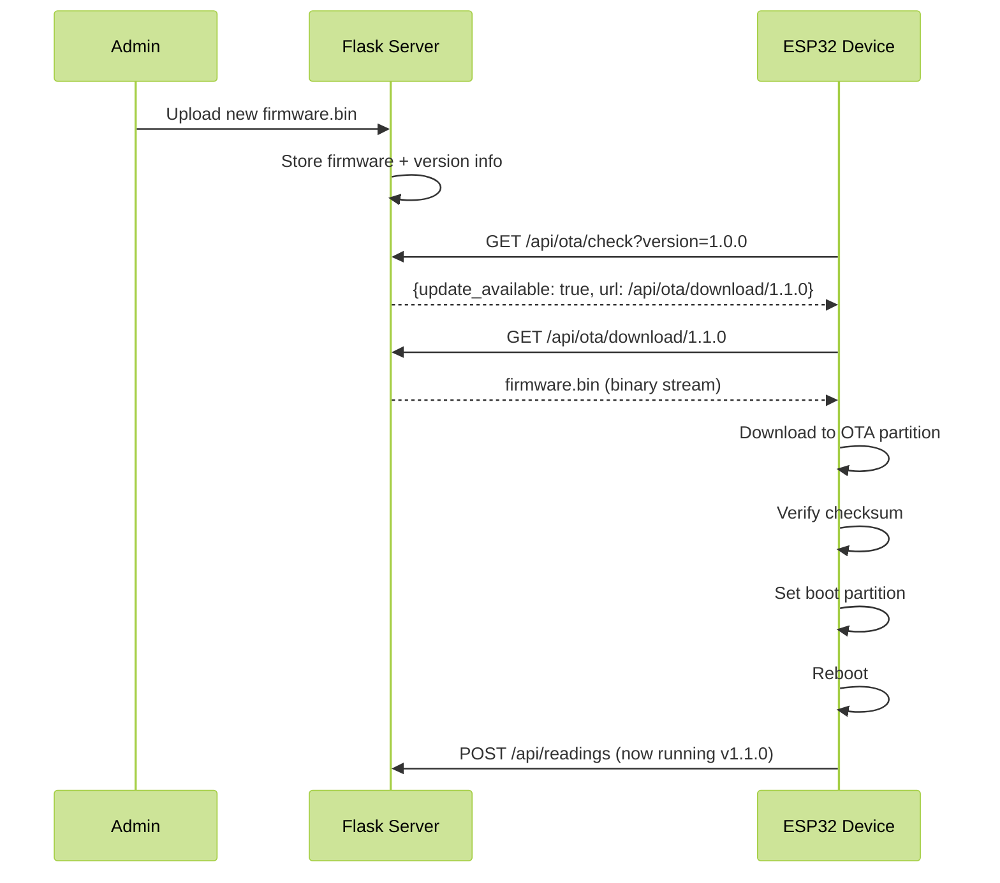

# Local Feather - OTA Update Guide

**Over-The-Air (OTA) firmware updates** allow you to update ESP32 devices remotely without USB cables.

## How It Works



## For Users

### Updating Devices via Web UI

1. **Build new firmware**:
   ```bash
   cd firmware
   pio run
   # Binary is at: .pio/build/esp32dev/firmware.bin
   ```

2. **Upload to server**:
   - Web UI → **Menu → Firmware → Upload New Firmware**
   - Select `firmware.bin` file
   - Enter version number (e.g., `1.1.0`)
   - Add release notes (optional)
   - Click **Upload**

3. **Devices auto-update**:
   - ESP32 devices check for updates every 6 hours
   - Or trigger manual check: restart device
   - Updates happen automatically when detected

4. **Monitor progress**:
   - Web UI shows which devices have updated
   - Serial monitor on ESP32 shows download progress

### Manual OTA Trigger

To force OTA check immediately:
1. Press and hold RESET button on ESP32
2. Or power cycle the device
3. Device checks for updates on boot

## For Developers

### Version Numbering

Use semantic versioning: `MAJOR.MINOR.PATCH`

- **MAJOR**: Incompatible API changes (e.g., 1.x.x → 2.0.0)
- **MINOR**: New features, backward compatible (e.g., 1.0.x → 1.1.0)
- **PATCH**: Bug fixes (e.g., 1.0.0 → 1.0.1)

**Change version** in `platformio.ini`:
```ini
build_flags =
    -D VERSION=\"1.1.0\"  # Update this
```

### Building Firmware for OTA

```bash
# Clean build
pio run --target clean

# Build release firmware
pio run

# Firmware binary location
ls -lh .pio/build/esp32dev/firmware.bin
```

**Important**: Always test new firmware on one device before deploying to all devices!

### OTA Partition Scheme

ESP32 uses dual OTA partitions for safe updates:

```
Flash Layout:
├── Bootloader (16KB)
├── Partition Table (4KB)
├── NVS (20KB)         # Config storage
├── OTA Data (8KB)     # Which partition to boot
├── App 0 (1.3MB)      # Current firmware
├── App 1 (1.3MB)      # New firmware downloads here
└── SPIFFS (remaining)
```

**How it works**:
1. Device boots from **App 0**
2. OTA downloads firmware to **App 1**
3. On success, marks **App 1** as bootable
4. Reboot → boots from **App 1** (now current)
5. Next OTA downloads to **App 0** (alternating)

**Rollback**: If new firmware crashes on boot, ESP32 automatically rolls back to previous version after 3 failed boots.

## Serial Monitor Output

### Normal OTA Update

```
🔍 Checking for OTA updates...
Current version: 1.0.0
URL: http://192.168.1.100:5000/api/ota/check?device_id=esp32-a1b2c3&version=1.0.0

🔄 ================================
     OTA UPDATE AVAILABLE
   ================================
   Current:  1.0.0
   New:      1.1.0
   Size:     987654 bytes
   ================================

Downloading from: http://192.168.1.100:5000/api/ota/download/1.1.0

📥 Starting OTA update...
⚠ DO NOT power off device!

📊 Progress: 10% (98765 / 987654 bytes)
📊 Progress: 20% (197530 / 987654 bytes)
📊 Progress: 30% (296295 / 987654 bytes)
...
📊 Progress: 100% (987654 / 987654 bytes)

✓ Download complete

✅ ================================
     UPDATE SUCCESSFUL!
   ================================
   Updated to version: 1.1.0
   ================================

✓ Update partition verified: ota_1
🔄 Rebooting in 3 seconds...

Rebooting NOW...

=================================
Local Feather ESP32 Firmware
Version: 1.1.0  ← Now running new version!
=================================
```

### Failed Update

```
🔍 Checking for OTA updates...

❌ Update failed: Error 4
   Not enough space for update

⚠ Staying on current firmware version
```

## LED Indicators During OTA

| Pattern | Meaning |
|---------|---------|
| Rapid blinking (5 times) | Update detected, preparing download |
| Solid ON | Downloading firmware |
| 3 long blinks | Update successful |
| Back to normal | Update failed, resumed normal operation |

## Troubleshooting

### Update Always Fails

**1. Not enough flash space**

Check partition table in `platformio.ini`:
```ini
board_build.partitions = default.csv  # Use default OTA partitions
```

Or create custom partition table with more space for OTA.

**2. Server unreachable during download**

- Ensure WiFi signal is strong
- Server must stay online during download (1-2 minutes)
- Use Ethernet for server if possible

**3. Wrong firmware binary**

- Make sure you're uploading the `.bin` file from `.pio/build/esp32dev/firmware.bin`
- NOT the `.elf` file
- File should be ~800KB - 1.2MB

### Update Downloads but Device Won't Boot

**Automatic rollback**:
- ESP32 automatically rolls back after 3 failed boot attempts
- Check serial monitor for crash logs
- Fix bug in new firmware and try again

**Manual rollback via USB**:
```bash
# Flash old firmware via USB
pio run --target upload
```

### Devices Don't Check for Updates

**Check update interval** (6 hours by default):
- Restart device to force immediate check
- Or reduce check interval in code:
  ```cpp
  if (millis() - lastOTACheck >= 21600000) { // 6 hours
  ```
  Change to `3600000` for 1 hour

### OTA Download Stalls

**Causes**:
- Weak WiFi signal
- Server overloaded
- Not enough RAM on ESP32

**Solutions**:
- Move ESP32 closer to router during update
- Update one device at a time
- Increase HTTP timeout in code if needed

## Security Considerations

### Current Implementation

**v1.0**:
- ✅ Firmware served over HTTP(S)
- ✅ Server validates admin uploaded firmware
- ✅ ESP32 verifies download completion
- ❌ No firmware signature verification (yet)

**Risk**: If someone gains access to your local network and server, they could upload malicious firmware.

**Mitigation**:
- Keep server on trusted local network only
- Use strong admin passwords
- Monitor firmware uploads in server logs

### Future Enhancements (v2.0)

**Planned**:
- Cryptographic signature verification
- Encrypted firmware downloads
- Device-specific firmware targeting
- Staged rollouts (update subset of devices first)

## Advanced: Custom OTA Behavior

### Disable Auto-Updates

Comment out in `loop()`:
```cpp
// if (millis() - lastOTACheck >= 21600000) {
//     lastOTACheck = millis();
//     checkForOTAUpdate();
// }
```

Devices will not auto-update, only update on manual trigger.

### OTA Only on User Trigger

Add button press check:
```cpp
if (digitalRead(TRIGGER_PIN) == LOW) {
    checkForOTAUpdate();
}
```

### Conditional OTA

Update only during specific times:
```cpp
// Only check for updates between 2 AM - 4 AM
struct tm timeinfo;
getLocalTime(&timeinfo);
if (timeinfo.tm_hour >= 2 && timeinfo.tm_hour < 4) {
    checkForOTAUpdate();
}
```

### OTA Progress Callback

Monitor OTA progress in your own code:
```cpp
httpUpdate.onProgress([](int current, int total) {
    // Send progress to server
    // Update local display
    // etc.
});
```

## Testing OTA Updates

### Test Procedure

1. **Prepare test device**:
   - Flash firmware v1.0.0
   - Register with server
   - Verify it's sending data

2. **Make small change**:
   - Change `VERSION` to `1.0.1`
   - Change LED blink pattern (easy to verify)
   - Build firmware

3. **Upload to server**:
   - Upload `firmware.bin` as version `1.0.1`

4. **Trigger update**:
   - Restart ESP32 device
   - Watch serial monitor

5. **Verify**:
   - Device should download and update
   - Check new version in serial output
   - Verify LED pattern changed
   - Check server shows device on v1.0.1

6. **Test rollback**:
   - Flash firmware with intentional crash
   - Device should auto-rollback to v1.0.1

### Integration Testing

Test with multiple devices:
- Update one device first
- Verify it works
- Update remaining devices
- Monitor server for any devices that fail

## Production Deployment

### Checklist

Before deploying OTA update to production:

- [ ] Test new firmware on dev/test device
- [ ] Verify all sensors work
- [ ] Check memory usage (`ESP.getFreeHeap()`)
- [ ] Run for 24 hours without crashes
- [ ] Version number incremented
- [ ] Release notes written
- [ ] Rollback plan ready (previous firmware.bin saved)
- [ ] Monitor server logs during rollout
- [ ] Update max 5 devices at once (not all simultaneously)

### Staged Rollout

1. **Dev device** (1 device)
   - Upload as `1.1.0-beta`
   - Test for 24-48 hours

2. **Canary group** (10% of devices)
   - Upload as `1.1.0`
   - Monitor for 24 hours
   - Check for increased errors/crashes

3. **Full rollout** (all devices)
   - If canary group successful, all devices will auto-update within 6 hours
   - Monitor server dashboard

4. **Post-deployment**
   - Check all devices updated successfully
   - Review any error logs
   - Document issues for next release

## FAQ

**Q: Can I update devices without rebooting them?**
A: No, ESP32 must reboot to switch to new firmware partition.

**Q: What happens if power fails during update?**
A: Device will boot from old firmware (update partition not marked bootable yet). Safe!

**Q: Can I downgrade firmware?**
A: Yes, upload older firmware with older version number. Device will "update" to it.

**Q: How long does OTA update take?**
A: 1-3 minutes depending on WiFi speed and firmware size.

**Q: Can multiple devices update simultaneously?**
A: Yes, but it's better to stagger updates (update 5-10 at a time).

**Q: Will I lose device configuration during OTA?**
A: No! NVS storage (WiFi, API keys, etc.) is preserved during OTA.

**Q: Can I force a specific device to NOT update?**
A: Not yet in v1.0. V2.0 will support per-device update control.

**Q: What if I upload wrong firmware (for different board)?**
A: ESP32 bootloader will reject it and rollback to current version.

---

**OTA is LIVE!** The firmware now fully supports over-the-air updates. Test it out! 🚀
