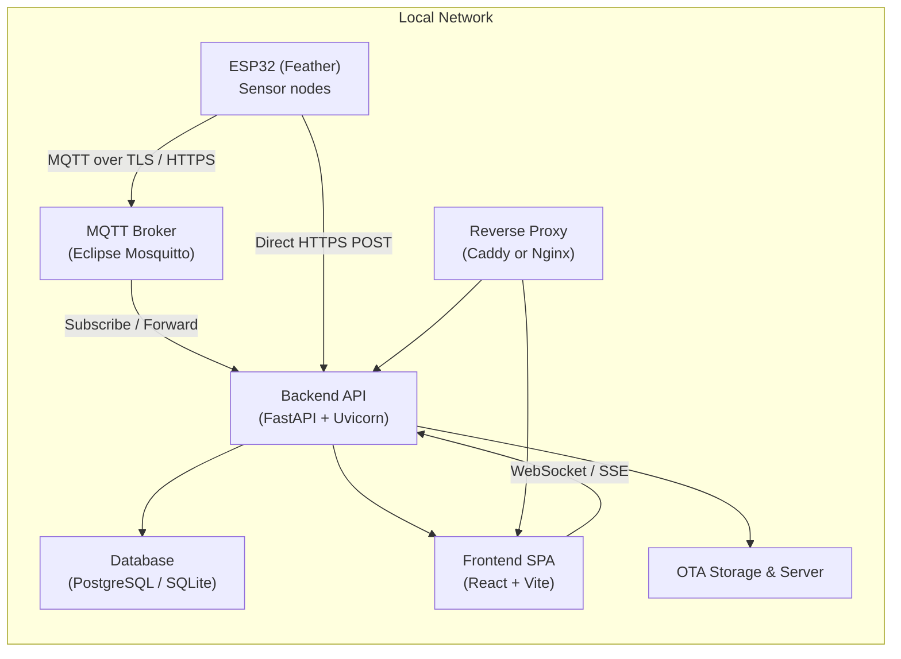
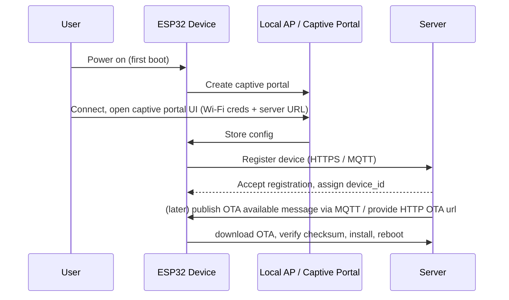

<!-- DESIGN.md for Local Feather -->
# Local Feather — Design Document

## Overview

Local Feather collects sensor data with ESP32-based Feather devices and stores it on a local database server (Raspberry Pi / Linux VM / Windows). It prioritizes working purely on the local network (no external internet needed), secure and modular communication, OTA updates, and a user-friendly web UI for monitoring, configuration, and diagnostics.

## Goals

- Provide reliable local collection and storage of sensor data.
- Support multiple sensor types and easy extensibility.
- Secure communication (TLS / authenticated access) between devices and server.
- User-friendly web interface for monitoring, configuration, and OTA management.
- Robustness against intermittent network connectivity and local backups.

## Scope

- In-scope: ESP32 firmware, local server application (API + web UI), database schema and backup policy, OTA update mechanism, documentation and tests for critical components.
- Out-of-scope: cloud integrations (optional future work), complex analytics beyond basic trend visualization.

## High-level Architecture

- Devices: ESP32 (Feather) running firmware that reads sensors, buffers data, and transmits to the server via MQTT over TLS or HTTPS REST.
- Local Network: LAN/Wi-Fi router for connectivity; all communication occurs within local network.
- Server: A small local server (Raspberry Pi or VM) running a service that accepts device data, stores it in a database, serves a web UI, and manages OTA updates.
- Database: Compatible with SQLite (single-device or small deployments), MySQL or PostgreSQL (multiple-device or heavier loads).
- Web UI / API: Backend (FastAPI or Flask) exposes REST endpoints and WebSocket/Server-Sent-Events (SSE) for real-time updates. Frontend (Vue/React) provides dashboard, device config, user management and OTA controls.

## Architecture (Detailed)

This section expands the high-level architecture into concrete components, recommended technologies, background links, diagrams, and rationale for each choice. The design aims for simplicity, local-first operation, security, maintainability, and using mature, well-maintained projects where possible.

### Architecture diagram (overview)

### Components, links, and rationale

- ESP32 Firmware (Platform to develop on)
  - Examples / tools: PlatformIO ([platformio.org](https://platformio.org/)) or Arduino IDE ([arduino.cc](https://www.arduino.cc/)). Espressif ESP-IDF for production/native development: [ESP-IDF docs](https://docs.espressif.com/projects/esp-idf).
  - Communication libs: Async MQTT client for ESP ([async-mqtt-client](https://github.com/marvinroger/async-mqtt-client)) or `PubSubClient` for simpler Arduino builds ([pubsubclient](https://github.com/knolleary/pubsubclient)).
  - Filesystem / persistent queue: LittleFS or SPIFFS for buffering when offline.
  - Captive portal / provisioning: WiFiManager ([WiFiManager](https://github.com/tzapu/WiFiManager)) or a small captive portal using `ESPAsyncWebServer` ([ESPAsyncWebServer](https://github.com/me-no-dev/ESPAsyncWebServer)).
  - OTA: ESP32 HTTP update (`ESP32HTTPUpdate`) or ArduinoOTA for local network firmware updates.
  - Rationale: ESP32 ecosystem libraries are mature, widely used, and supported across PlatformIO/Arduino/ESP-IDF. Use of `Async` MQTT and `ESPAsyncWebServer` reduces blocking I/O on the device.

- Device Communication
  - Primary: MQTT over TLS. MQTT is lightweight, supports pub/sub, last-will, retained messages, and suits intermittent connectivity.
  - Secondary/fallback: HTTPS REST POST for simple single-shot uploads.
  - Rationale: MQTT reduces overhead and enables server-to-device commands (subscriptions). HTTPS provides a simple path for constrained setups or troubleshooting.

- MQTT Broker
  - Recommended: Eclipse Mosquitto ([mosquitto.org](https://mosquitto.org/)). Lightweight, widely packaged for Raspberry Pi and Linux, actively maintained.
  - Alternative: EMQX ([emqx.io](https://www.emqx.io/)) or HiveMQ Community for higher scale, but Mosquitto is simplest and proven for local deployments.

- Backend API / Ingest Service
  - Recommended: FastAPI ([fastapi.tiangolo.com](https://fastapi.tiangolo.com/)) + Uvicorn. Fast, asynchronous, developer-friendly, excellent OpenAPI support.
  - MQTT client for backend: `asyncio-mqtt` ([asyncio-mqtt](https://github.com/sbtinstruments/asyncio-mqtt)) or `paho-mqtt` for synchronous designs.
  - Data modeling / ORM: SQLModel ([sqlmodel.tiangolo.com](https://sqlmodel.tiangolo.com/)) or SQLAlchemy + Alembic for migrations.
  - Rationale: FastAPI integrates well with async MQTT clients, websockets, and provides straightforward patterns for auth and dependency injection.

- Database
  - Small installs: SQLite ([sqlite.org](https://www.sqlite.org/)) for zero-admin operation.
  - Multi-device or scalable: PostgreSQL ([postgresql.org](https://www.postgresql.org/)) for robustness, concurrency, and features.
  - Rationale: Using SQLite lowers the barrier for new users; Postgres provides a path for production and scale.

- Web UI (Dashboard)
  - Framework: React ([reactjs.org](https://reactjs.org/)) with Vite ([vitejs.dev](https://vitejs.dev/)) for fast developer experience and small bundle sizes.
  - Charts: Chart.js via `react-chartjs-2` ([chartjs.org](https://www.chartjs.org/)) or `Recharts` for declarative charts. Use a well-maintained charting library instead of custom plotting.
  - Rationale: React + Vite yields a simple, modern SPA with good ecosystem support. Chart.js is mature and sufficient for time-series dashboards.

- Reverse Proxy & TLS
  - Recommended: Caddy ([caddyserver.com](https://caddyserver.com/)) for automatic TLS in environments with internet access; Nginx ([nginx.org](https://nginx.org/)) for classic setups. For local-only networks use `mkcert` to generate dev CA certs ([mkcert](https://github.com/FiloSottile/mkcert)).
  - Rationale: A reverse proxy centralizes TLS, serves static SPA, and simplifies exposing a single port. Caddy is simpler to configure for HTTPS, Nginx is ubiquitous and flexible.

- Authentication & Authorization
  - Option A (simple): JWT-based auth implemented in FastAPI with role-based access (admin/operator/viewer).
  - Option B (advanced): External IdP (Keycloak: https://www.keycloak.org/) for SSO and richer enterprise features.
  - Rationale: Start with JWT for simplicity. Offer Keycloak integration later for larger deployments.

- Certificate Management
  - Tools: `mkcert` for creating locally-trusted certificates, or host CA files via admin docs for IT-managed networks.

- Logging, Metrics, and Diagnostics
  - Logging: structured JSON logs via Python `structlog` or standard logging to files with rotation.
  - Metrics: Expose Prometheus metrics endpoint (Prometheus: https://prometheus.io/) for resource and performance monitoring.

### Mermaid diagram — provisioning and OTA flow

### Which parts to develop vs integrate

- Develop (project-specific):
  - ESP32 firmware: sensor drivers, config UI (captive portal), persistent buffering, message formats, OTA client integration.
  - Backend ingestion & API: topic/message validation, business logic, device registry, role-based auth, WebSocket/SSE events, export endpoints, data retention and backup code.
  - Web UI: dashboard, device management pages, alerts, exports, and role-based views.
  - Database schema & migrations tailored to sensor model and query patterns.

- Integrate / configure (existing projects):
  - MQTT Broker: Mosquitto (install & configure rather than build).
  - Database engine: PostgreSQL or SQLite (configure and maintain backups).
  - Reverse proxy & TLS: Caddy or Nginx, mkcert for local certs.
  - Charting and UI components: `react-chartjs-2`, component libraries (e.g., Mantine, MUI) to speed development.
  - MQTT / TLS libraries and ESP toolchain: use well-tested open-source libs rather than reimplementing protocols.

### Rationale summary

- Simplicity & maturity: Choosing Mosquitto + FastAPI + React + PostgreSQL/SQLite keeps the stack small and well-understood, with large communities and documentation.
- Local-first: All recommended components can run on a single Raspberry Pi for small deployments, or be scaled to VMs for more devices.
- Security & maintainability: TLS for transport, JWT/key-based device auth, and use of mature libraries reduce security risk compared to custom protocols.
- Extensibility: Modular firmware and a REST+MQTT backend let future integrations (Home Assistant, cloud bridges) be added as optional adapters.

If you'd like, I can now:

- Scaffold the minimal server (FastAPI) with endpoints and SQLite support and a simple Docker compose.
- Scaffold a simple React + Vite dashboard with example charts and a mock API.
- Create a PlatformIO firmware skeleton with WiFi provisioning and MQTT publish example.

Tell me which one to start with (server, frontend, or firmware skeleton) and I'll scaffold it next.

## Component Design

- ESP32 Firmware
  - Connectivity: Wi-Fi management module (AP mode for initial provisioning; station mode for normal operation).
  - Protocols: MQTT over TLS (preferred for lightweight pub/sub) with optional HTTPS REST fallback for simple setups.
  - Buffering: Local ring buffer / persistent queue (SPIFFS/LittleFS) to store readings when offline, with retry & backoff.
  - OTA: HTTP/SOTA (server-hosted OTA file with signed/hashed images) and integration with ESP32's OTA APIs.
  - Config: Local web captive portal for provisioning; remote config via server API (with authentication).

- Local Server
  - Ingest: MQTT broker (e.g., Mosquitto) or direct HTTP endpoints to receive device data.
  - Processing: A service (Python—FastAPI) subscribes to MQTT topics or receives HTTP posts, validates payloads, and writes to DB.
  - Storage: Database schema optimized for time-series sensor data (timestamp, device_id, sensor_type, value, units, metadata).
  - Web UI: SPA frontend served by the backend. Real-time updates via WebSocket or SSE using data from server.
  - Auth: JWT-based user authentication with roles (admin, operator, viewer).

## Data Model (example)

- devices: id, name, hw_id, firmware_version, last_seen, status
- sensors: id, device_id, type, name, units, config_json
- readings: id, device_id, sensor_id, ts_utc, value, raw_json
- events/logs: id, ts_utc, level, component, message, meta_json

## Communication & Security

- Use MQTT over TLS for low-latency pub/sub; use TLS with server-side certificates that are trusted within the LAN.
- For REST, use HTTPS (TLS). Self-signed certs are acceptable for local networks; provide instructions to install CA in admin docs.
- Device authentication via pre-shared tokens or client certs; server enforces authentication and authorization.
- Ensure data integrity with checksums and idempotent ingestion (server accepts message-id to avoid duplication).

## Handling Network Interruptions & Reliability

- On-device: store outgoing messages to persistent queue (SPIFFS/LittleFS) and retry with exponential backoff.
- Server: accept batched uploads from devices after reconnection; provide endpoints for bulk ingestion.
- Backup: server-side rolling backups of DB and export tools (CSV/JSON). Provide a local USB backup option if using Raspberry Pi.

## OTA Update Strategy

- Host firmware images on the local server with versioned endpoints (e.g., `/ota/latest?device_type=feather32`).
- Devices poll periodically or check-in on boot; server returns metadata (version, checksum, url). Device downloads and verifies before swapping image.

## Web UI Features

- Dashboard: real-time charts, device status, latest readings.
- Device Management: register/unregister devices, configure sensor parameters, initiate OTA, set reporting intervals.
- Alerts: configure thresholds and receive on-dashboard alerts (future: local email/bridge to home automation).
- Data Export: CSV/JSON exports for selected time ranges.
- Multi-user: Admin and operator roles with appropriate restrictions.

## Requirement Mapping (selected)

- Connect to local Wi-Fi network: Firmware supports WPA2/3 station mode and captive portal provisioning.
- Detect/read multiple sensors: Firmware supports multi-sensor polling and modular sensor drivers.
- Send sensor data to server: MQTT/HTTPS endpoints accept readings; server persists to DB.
- Receive commands from server: Use MQTT subscription or REST commands to push configuration or trigger OTA.
- Web interface for monitoring/config: Backend + SPA provide dashboard, config pages.
- Network interruptions: Device buffer + retry; server supports bulk ingestion.
- Secure comms: TLS for MQTT/HTTP; auth tokens/JWT.
- DB compatibility: Provide SQLite for small setups, adapters for MySQL/Postgres.
- OTA updates: Server-hosted images with signed hashes, device OTA flow.

## Testing & Validation

- Unit tests for server ingestion, auth, and data model.
- Integration tests: simulated device uploads, reconnection, bulk ingestion.
- Performance tests: DB write benchmarks; test scale of concurrent devices.

## Deployment & Setup (quick)

1. Install server dependencies (Python 3.10+, virtualenv, MQTT broker). Provide `requirements.txt`.
2. Configure database (SQLite for small installs; MySQL/Postgres optional). Run migrations.
3. Start MQTT broker and backend service. Load default certs / generate CA for LAN.
4. Flash sample firmware on ESP32, use captive portal to provision Wi-Fi, point to server.

## Extensibility

- Modular sensor drivers on the device allow adding new sensors by dropping a driver module.
- Server plugins to add new visualizations, exporters, or integrations (Home Assistant bridge).

## Documentation & Next Steps

- Produce step-by-step installer guides (Raspberry Pi, Linux VM, Windows dev), firmware flashing guide, and troubleshooting.
- Create minimal working example: 1 ESP32 + SQLite server + web UI.
- Implement CI for server tests and build automation for firmware images.

---

This design targets the functional and non-functional requirements in `docs/REQUIREMENTS.md`. The next immediate task is to produce an implementation plan with milestones and a minimal end-to-end prototype (ESP32 -> server -> DB -> web UI).
