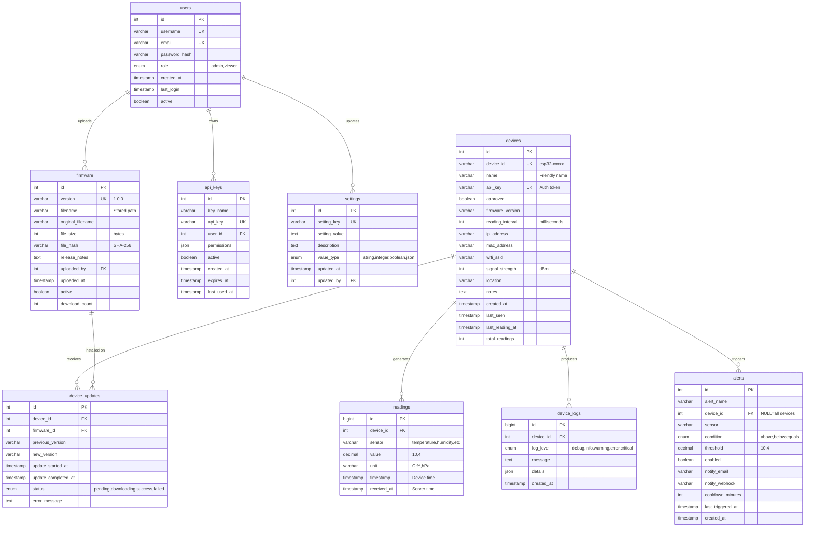

# Local Feather - Database Setup

This directory contains database schema, migrations, and setup scripts for Local Feather.

## Quick Start

### 1. Configure Database Connection

```bash
# Copy example config
cp config.example.ini config.ini

# Edit with your MariaDB credentials
nano config.ini
```

Update these settings in `config.ini`:

```ini
[database]
host = localhost          # Your MariaDB server IP or hostname
port = 3306
database = localfeather
username = localfeather_user
password = YOUR_STRONG_PASSWORD_HERE
```

### 2. Create Database and User (MariaDB)

Connect to your MariaDB server and run:

```sql
-- Create database
CREATE DATABASE IF NOT EXISTS localfeather
    CHARACTER SET utf8mb4
    COLLATE utf8mb4_unicode_ci;

-- Create user (change password!)
CREATE USER IF NOT EXISTS 'localfeather_user'@'%'
    IDENTIFIED BY 'YOUR_STRONG_PASSWORD_HERE';

-- Grant permissions
GRANT ALL PRIVILEGES ON localfeather.* TO 'localfeather_user'@'%';
FLUSH PRIVILEGES;

-- Verify
SHOW DATABASES;
SELECT user, host FROM mysql.user WHERE user = 'localfeather_user';
```

### 3. Import Schema

```bash
# Import schema into MariaDB
mysql -h localhost -u localfeather_user -p localfeather < schema.sql

# Or using mariadb command
mariadb -h localhost -u localfeather_user -p localfeather < schema.sql
```

### 4. Seed Test Data (Optional)

```bash
# Install Python dependencies first
cd ..
pip install sqlalchemy pymysql werkzeug

# Run seed script
python database/seed_data.py
```

This creates:
- 2 test users (admin/viewer)
- 4 sample devices
- 144 sample sensor readings
- 2 firmware versions
- Sample device logs and alerts

**Default login credentials:**
- Admin: `admin` / `admin123`
- Viewer: `viewer` / `viewer123`

⚠️ **Change these passwords immediately in production!**

---

## Files in This Directory

### Configuration
- **`config.example.ini`** - Example configuration (copy to `config.ini`)
- **`config.ini`** - Your actual config (**DO NOT commit to git!**)

### Schema
- **`schema.sql`** - Complete MariaDB schema definition
  - Tables for users, devices, readings, firmware, etc.
  - Indexes for performance
  - Views for common queries
  - Stored procedures for maintenance

### Scripts
- **`seed_data.py`** - Populate database with test data
- **`README.md`** - This file

---

## Database Schema

### Entity Relationship Diagram



### Complete Data Dictionary

#### Table: `users`
**Purpose:** Web UI user accounts with authentication and authorization

| Column | Type | Constraints | Description |
|--------|------|-------------|-------------|
| `id` | INT | PK, AUTO_INCREMENT | Unique user identifier |
| `username` | VARCHAR(50) | NOT NULL, UNIQUE, INDEX | Login username |
| `email` | VARCHAR(100) | NOT NULL, UNIQUE, INDEX | User email address |
| `password_hash` | VARCHAR(255) | NOT NULL | Bcrypt hashed password |
| `role` | ENUM('admin', 'viewer') | NOT NULL, DEFAULT 'viewer' | User permission level |
| `created_at` | TIMESTAMP | DEFAULT CURRENT_TIMESTAMP | Account creation time |
| `last_login` | TIMESTAMP | NULL | Last successful login |
| `active` | BOOLEAN | DEFAULT TRUE | Whether account is enabled |

**Indexes:**
- PRIMARY KEY: `id`
- UNIQUE KEY: `username`, `email`
- INDEX: `idx_username`, `idx_email`

**Relationships:**
- Has many `firmware` (uploaded_by)
- Has many `api_keys` (user_id)
- Has many `settings` updates (updated_by)

---

#### Table: `devices`
**Purpose:** ESP32 device registry with configuration and metadata

| Column | Type | Constraints | Description |
|--------|------|-------------|-------------|
| `id` | INT | PK, AUTO_INCREMENT | Unique device identifier |
| `device_id` | VARCHAR(50) | NOT NULL, UNIQUE, INDEX | Device identifier (e.g., esp32-a1b2c3) |
| `name` | VARCHAR(100) | NULL | User-friendly device name |
| `api_key` | VARCHAR(64) | NOT NULL, UNIQUE, INDEX | API authentication key (64-char hex) |
| `approved` | BOOLEAN | DEFAULT FALSE, INDEX | Device approval status |
| `firmware_version` | VARCHAR(20) | NULL | Current firmware version (e.g., 1.0.0) |
| `reading_interval` | INT | DEFAULT 60000 | Reading interval in milliseconds |
| `ip_address` | VARCHAR(45) | NULL | Last known IP address (IPv4/IPv6) |
| `mac_address` | VARCHAR(17) | NULL | Device MAC address (AA:BB:CC:DD:EE:FF) |
| `wifi_ssid` | VARCHAR(32) | NULL | Connected WiFi network name |
| `signal_strength` | INT | NULL | WiFi signal strength in dBm (-100 to 0) |
| `location` | VARCHAR(100) | NULL | Physical location description |
| `notes` | TEXT | NULL | User notes about the device |
| `created_at` | TIMESTAMP | DEFAULT CURRENT_TIMESTAMP | Device registration time |
| `last_seen` | TIMESTAMP | NULL, INDEX | Last successful communication |
| `last_reading_at` | TIMESTAMP | NULL | Last reading received timestamp |
| `total_readings` | INT | DEFAULT 0 | Total number of readings received |

**Indexes:**
- PRIMARY KEY: `id`
- UNIQUE KEY: `device_id`, `api_key`
- INDEX: `idx_device_id`, `idx_api_key`, `idx_approved`, `idx_last_seen`

**Relationships:**
- Has many `readings` (device_id)
- Has many `device_updates` (device_id)
- Has many `device_logs` (device_id)
- Has many `alerts` (device_id)

---

#### Table: `readings`
**Purpose:** Time-series sensor data from ESP32 devices

| Column | Type | Constraints | Description |
|--------|------|-------------|-------------|
| `id` | BIGINT | PK, AUTO_INCREMENT | Unique reading identifier |
| `device_id` | INT | NOT NULL, FK, INDEX | Reference to devices table |
| `sensor` | VARCHAR(50) | NOT NULL, INDEX | Sensor type (temperature, humidity, pressure, etc.) |
| `value` | DECIMAL(10,4) | NOT NULL | Sensor reading value (6 digits before decimal, 4 after) |
| `unit` | VARCHAR(20) | NOT NULL | Unit of measurement (C, F, %, hPa, etc.) |
| `timestamp` | TIMESTAMP | NOT NULL, INDEX | Reading timestamp from device clock |
| `received_at` | TIMESTAMP | DEFAULT CURRENT_TIMESTAMP | Server received timestamp (for drift detection) |

**Indexes:**
- PRIMARY KEY: `id`
- FOREIGN KEY: `device_id` → `devices(id)` ON DELETE CASCADE
- INDEX: `idx_device_sensor` (device_id, sensor)
- INDEX: `idx_timestamp` (timestamp)
- INDEX: `idx_device_timestamp` (device_id, timestamp)
- INDEX: `idx_readings_device_time_sensor` (device_id, timestamp DESC, sensor)
- INDEX: `idx_sensor` (sensor)

**Relationships:**
- Belongs to `devices` (device_id)

**Notes:**
- High-volume table - consider partitioning by timestamp for large deployments
- `timestamp` vs `received_at` allows detection of clock drift or delayed submissions

---

#### Table: `firmware`
**Purpose:** OTA firmware binary storage and version management

| Column | Type | Constraints | Description |
|--------|------|-------------|-------------|
| `id` | INT | PK, AUTO_INCREMENT | Unique firmware identifier |
| `version` | VARCHAR(20) | NOT NULL, UNIQUE, INDEX | Semantic version (e.g., 1.0.1) |
| `filename` | VARCHAR(255) | NOT NULL | Stored filename on disk |
| `original_filename` | VARCHAR(255) | NOT NULL | Original uploaded filename |
| `file_size` | INT | NOT NULL | File size in bytes |
| `file_hash` | VARCHAR(64) | NOT NULL | SHA-256 hash for integrity verification |
| `release_notes` | TEXT | NULL | Markdown-formatted release notes |
| `uploaded_by` | INT | FK, NULL | User who uploaded the firmware |
| `uploaded_at` | TIMESTAMP | DEFAULT CURRENT_TIMESTAMP | Upload timestamp |
| `active` | BOOLEAN | DEFAULT TRUE, INDEX | Whether available for OTA updates |
| `download_count` | INT | DEFAULT 0 | Number of successful downloads |

**Indexes:**
- PRIMARY KEY: `id`
- UNIQUE KEY: `version`
- FOREIGN KEY: `uploaded_by` → `users(id)` ON DELETE SET NULL
- INDEX: `idx_version`, `idx_active`

**Relationships:**
- Belongs to `users` (uploaded_by)
- Has many `device_updates` (firmware_id)

---

#### Table: `device_updates`
**Purpose:** Track OTA update history and status for each device

| Column | Type | Constraints | Description |
|--------|------|-------------|-------------|
| `id` | INT | PK, AUTO_INCREMENT | Unique update record identifier |
| `device_id` | INT | NOT NULL, FK | Reference to devices table |
| `firmware_id` | INT | NOT NULL, FK | Reference to firmware table |
| `previous_version` | VARCHAR(20) | NULL | Version before update |
| `new_version` | VARCHAR(20) | NOT NULL | Target firmware version |
| `update_started_at` | TIMESTAMP | DEFAULT CURRENT_TIMESTAMP | When update began |
| `update_completed_at` | TIMESTAMP | NULL | When update finished (NULL if in progress) |
| `status` | ENUM | DEFAULT 'pending' | pending, downloading, success, failed |
| `error_message` | TEXT | NULL | Error details if status=failed |

**Indexes:**
- PRIMARY KEY: `id`
- FOREIGN KEY: `device_id` → `devices(id)` ON DELETE CASCADE
- FOREIGN KEY: `firmware_id` → `firmware(id)` ON DELETE CASCADE
- INDEX: `idx_device_status` (device_id, status)
- INDEX: `idx_firmware` (firmware_id)

**Relationships:**
- Belongs to `devices` (device_id)
- Belongs to `firmware` (firmware_id)

---

#### Table: `settings`
**Purpose:** Application configuration as key-value pairs

| Column | Type | Constraints | Description |
|--------|------|-------------|-------------|
| `id` | INT | PK, AUTO_INCREMENT | Unique setting identifier |
| `setting_key` | VARCHAR(100) | NOT NULL, UNIQUE, INDEX | Setting identifier key |
| `setting_value` | TEXT | NOT NULL | Setting value (stored as string, parsed by type) |
| `description` | TEXT | NULL | Human-readable description |
| `value_type` | ENUM | DEFAULT 'string' | string, integer, boolean, json |
| `updated_at` | TIMESTAMP | DEFAULT CURRENT_TIMESTAMP ON UPDATE | Last modification time |
| `updated_by` | INT | FK, NULL | User who last modified |

**Indexes:**
- PRIMARY KEY: `id`
- UNIQUE KEY: `setting_key`
- FOREIGN KEY: `updated_by` → `users(id)` ON DELETE SET NULL
- INDEX: `idx_key` (setting_key)

**Relationships:**
- Belongs to `users` (updated_by)

**Default Settings:**
- `site_name`: "Local Feather"
- `default_reading_interval`: 60000 (ms)
- `auto_approve_devices`: false
- `data_retention_days`: 365
- `enable_ota_updates`: true
- `max_devices`: 50
- `timezone`: "America/New_York"

---

#### Table: `api_keys`
**Purpose:** External API authentication tokens

| Column | Type | Constraints | Description |
|--------|------|-------------|-------------|
| `id` | INT | PK, AUTO_INCREMENT | Unique API key identifier |
| `key_name` | VARCHAR(100) | NOT NULL | Descriptive name for the key |
| `api_key` | VARCHAR(64) | NOT NULL, UNIQUE, INDEX | The actual API token (64-char hex) |
| `user_id` | INT | FK, NULL | User who created this key |
| `permissions` | JSON | NULL | JSON object defining allowed operations |
| `active` | BOOLEAN | DEFAULT TRUE, INDEX | Whether key is currently valid |
| `created_at` | TIMESTAMP | DEFAULT CURRENT_TIMESTAMP | Key creation time |
| `expires_at` | TIMESTAMP | NULL | Optional expiration date |
| `last_used_at` | TIMESTAMP | NULL | Last successful authentication |

**Indexes:**
- PRIMARY KEY: `id`
- UNIQUE KEY: `api_key`
- FOREIGN KEY: `user_id` → `users(id)` ON DELETE CASCADE
- INDEX: `idx_api_key`, `idx_active`

**Relationships:**
- Belongs to `users` (user_id)

---

#### Table: `device_logs`
**Purpose:** Device events, errors, and diagnostic information

| Column | Type | Constraints | Description |
|--------|------|-------------|-------------|
| `id` | BIGINT | PK, AUTO_INCREMENT | Unique log entry identifier |
| `device_id` | INT | NOT NULL, FK | Reference to devices table |
| `log_level` | ENUM | DEFAULT 'info' | debug, info, warning, error, critical |
| `message` | TEXT | NOT NULL | Log message text |
| `details` | JSON | NULL | Additional structured log data |
| `created_at` | TIMESTAMP | DEFAULT CURRENT_TIMESTAMP, INDEX | Log entry timestamp |

**Indexes:**
- PRIMARY KEY: `id`
- FOREIGN KEY: `device_id` → `devices(id)` ON DELETE CASCADE
- INDEX: `idx_device_level` (device_id, log_level)
- INDEX: `idx_created` (created_at)

**Relationships:**
- Belongs to `devices` (device_id)

**Notes:**
- High-volume table - implement log rotation or retention policy
- `details` JSON can contain arbitrary diagnostic data from device

---

#### Table: `alerts`
**Purpose:** Alert rules and threshold monitoring configuration

| Column | Type | Constraints | Description |
|--------|------|-------------|-------------|
| `id` | INT | PK, AUTO_INCREMENT | Unique alert rule identifier |
| `alert_name` | VARCHAR(100) | NOT NULL | Descriptive alert name |
| `device_id` | INT | FK, NULL | Specific device (NULL = all devices) |
| `sensor` | VARCHAR(50) | NOT NULL | Which sensor to monitor |
| `condition` | ENUM | NOT NULL | above, below, equals |
| `threshold` | DECIMAL(10,4) | NOT NULL | Threshold value to trigger alert |
| `enabled` | BOOLEAN | DEFAULT TRUE, INDEX | Whether rule is active |
| `notify_email` | VARCHAR(100) | NULL | Email address for notifications |
| `notify_webhook` | VARCHAR(255) | NULL | Webhook URL for notifications |
| `cooldown_minutes` | INT | DEFAULT 60 | Minutes before re-alerting |
| `last_triggered_at` | TIMESTAMP | NULL | Last time alert was triggered |
| `created_at` | TIMESTAMP | DEFAULT CURRENT_TIMESTAMP | Rule creation time |

**Indexes:**
- PRIMARY KEY: `id`
- FOREIGN KEY: `device_id` → `devices(id)` ON DELETE CASCADE
- INDEX: `idx_enabled` (enabled)
- INDEX: `idx_device_sensor` (device_id, sensor)

**Relationships:**
- Belongs to `devices` (device_id) - optional (NULL = applies to all)

**Notes:**
- `device_id = NULL` creates a global alert that applies to all devices
- Cooldown prevents alert spam

---

### Database Views

#### View: `latest_readings`
**Purpose:** Get the most recent reading for each sensor on each device

```sql
SELECT
    r.id,
    r.device_id,
    d.device_id AS device_identifier,
    d.name AS device_name,
    r.sensor,
    r.value,
    r.unit,
    r.timestamp,
    r.received_at
FROM readings r
INNER JOIN (
    SELECT device_id, sensor, MAX(timestamp) AS max_timestamp
    FROM readings
    GROUP BY device_id, sensor
) latest ON r.device_id = latest.device_id
    AND r.sensor = latest.sensor
    AND r.timestamp = latest.max_timestamp
INNER JOIN devices d ON r.device_id = d.id;
```

**Usage:** Quickly display current state of all devices without scanning entire readings table

---

#### View: `device_stats`
**Purpose:** Summary statistics for each device

```sql
SELECT
    d.id,
    d.device_id,
    d.name,
    d.approved,
    d.firmware_version,
    d.last_seen,
    d.total_readings,
    COUNT(DISTINCT r.sensor) AS sensor_count,
    MIN(r.timestamp) AS first_reading_at,
    MAX(r.timestamp) AS last_reading_at,
    TIMESTAMPDIFF(HOUR, d.last_seen, NOW()) AS hours_since_seen
FROM devices d
LEFT JOIN readings r ON d.id = r.device_id
GROUP BY d.id;
```

**Usage:** Dashboard overview showing device health and activity

---

### Stored Procedures

#### Procedure: `cleanup_old_readings(days_to_keep INT)`
**Purpose:** Delete readings older than specified number of days

```sql
DELETE FROM readings
WHERE timestamp < DATE_SUB(NOW(), INTERVAL days_to_keep DAY);
```

**Usage:**
```sql
-- Delete readings older than 365 days
CALL cleanup_old_readings(365);
```

---

#### Procedure: `update_device_stats()`
**Purpose:** Refresh the `total_readings` counter for all devices

```sql
UPDATE devices d
LEFT JOIN (
    SELECT device_id, COUNT(*) AS total
    FROM readings
    GROUP BY device_id
) r ON d.id = r.device_id
SET d.total_readings = COALESCE(r.total, 0);
```

**Usage:**
```sql
-- Recalculate all device reading counts
CALL update_device_stats();
```

---

### Data Types Reference

| Type | Description | Use Case |
|------|-------------|----------|
| `INT` | 32-bit integer (-2B to 2B) | IDs, counts, intervals |
| `BIGINT` | 64-bit integer | High-volume tables (readings, logs) |
| `VARCHAR(n)` | Variable-length string | Names, identifiers, short text |
| `TEXT` | Long text (64KB) | Notes, messages, JSON |
| `DECIMAL(10,4)` | Fixed-point decimal | Sensor values (999999.9999) |
| `TIMESTAMP` | Date/time with timezone | All temporal data |
| `BOOLEAN` | True/false | Flags, status indicators |
| `ENUM` | Enumerated string values | Constrained choices (roles, status) |
| `JSON` | JSON document | Structured but flexible data |

---

### Character Set & Collation

All tables use:
- **Character Set:** `utf8mb4` (full Unicode support including emoji)
- **Collation:** `utf8mb4_unicode_ci` (case-insensitive, Unicode-aware sorting)

This ensures proper handling of international characters and modern Unicode features.

---

## Using with Flask

### Initialize Database Connection

```python
from app.database import init_db

# Initialize with MariaDB
db = init_db()

# Or use SQLite for development
db = init_db(use_dev=True)
```

### Query Examples

```python
from app.database import get_db
from app.models import Device, Reading, User

db = get_db()

# Get all approved devices
with db.session_scope() as session:
    devices = session.query(Device).filter_by(approved=True).all()

# Get recent readings for a device
with db.session_scope() as session:
    readings = session.query(Reading)\
        .filter_by(device_id=1)\
        .order_by(Reading.timestamp.desc())\
        .limit(100)\
        .all()

# Create a new user
from werkzeug.security import generate_password_hash

with db.session_scope() as session:
    user = User(
        username='newuser',
        email='newuser@example.com',
        password_hash=generate_password_hash('password'),
        role='viewer'
    )
    session.add(user)
    # Automatically committed at end of scope
```

---

## Development with SQLite

For development without MariaDB:

1. Edit `config.ini`:

```ini
[database_dev]
sqlite_path = ../data/localfeather_dev.db
```

2. Initialize with dev flag:

```python
from app.database import init_db

db = init_db(use_dev=True)
db.create_tables()
```

3. Seed data works the same:

```bash
# Modify seed_data.py to use use_dev=True
python database/seed_data.py
```

---

## Maintenance

### Backup Database

```bash
# Backup entire database
mysqldump -h localhost -u localfeather_user -p localfeather > backup_$(date +%Y%m%d).sql

# Backup with compression
mysqldump -h localhost -u localfeather_user -p localfeather | gzip > backup_$(date +%Y%m%d).sql.gz
```

### Restore from Backup

```bash
# Restore
mysql -h localhost -u localfeather_user -p localfeather < backup_20251130.sql

# Restore from compressed
gunzip < backup_20251130.sql.gz | mysql -h localhost -u localfeather_user -p localfeather
```

### Clean Up Old Readings

```sql
-- Delete readings older than 365 days
CALL cleanup_old_readings(365);

-- Check result
SELECT ROW_COUNT() AS rows_deleted;
```

### Optimize Tables

```sql
-- Analyze tables for query optimization
ANALYZE TABLE devices, readings;

-- Optimize tables (reclaim space)
OPTIMIZE TABLE readings;
```

### Check Database Size

```sql
-- Table sizes
SELECT
    table_name AS 'Table',
    ROUND(((data_length + index_length) / 1024 / 1024), 2) AS 'Size (MB)',
    table_rows AS 'Rows'
FROM information_schema.TABLES
WHERE table_schema = 'localfeather'
ORDER BY (data_length + index_length) DESC;
```

---

## Performance Tuning

### Indexes

The schema includes optimized indexes for:
- Device lookups by `device_id` and `api_key`
- Reading queries by `device_id`, `sensor`, and `timestamp`
- User authentication by `username` and `email`

### Partitioning (Large Deployments)

For high-volume deployments (100,000+ readings), enable partitioning:

```sql
-- Partition readings table by month
ALTER TABLE readings PARTITION BY RANGE (UNIX_TIMESTAMP(timestamp)) (
    PARTITION p_2025_11 VALUES LESS THAN (UNIX_TIMESTAMP('2025-12-01')),
    PARTITION p_2025_12 VALUES LESS THAN (UNIX_TIMESTAMP('2026-01-01')),
    PARTITION p_future VALUES LESS THAN MAXVALUE
);
```

### Connection Pooling

Configured in `config.ini`:

```ini
[database]
pool_size = 10          # Base connections
max_overflow = 20       # Additional connections when busy
pool_recycle = 3600     # Recycle connections after 1 hour
pool_pre_ping = true    # Test connections before use
```

---

## Troubleshooting

### Cannot Connect to MariaDB

**Error:** `Can't connect to MySQL server on 'localhost'`

**Solutions:**
1. Check MariaDB is running: `systemctl status mariadb`
2. Verify host/port in `config.ini`
3. Check firewall allows port 3306
4. Ensure MariaDB allows remote connections (if not localhost)

### Authentication Failed

**Error:** `Access denied for user 'localfeather_user'@'host'`

**Solutions:**
1. Verify username/password in `config.ini`
2. Check user exists: `SELECT user, host FROM mysql.user;`
3. Ensure proper permissions: `SHOW GRANTS FOR 'localfeather_user'@'%';`
4. Try wildcard host `'%'` instead of `'localhost'`

### Table Doesn't Exist

**Error:** `Table 'localfeather.devices' doesn't exist`

**Solution:**
```bash
# Import schema
mysql -h localhost -u localfeather_user -p localfeather < schema.sql

# Or use Python
python -c "from app.database import init_db; db = init_db(); db.create_tables()"
```

### Foreign Key Constraint Fails

**Error:** `Cannot add or update a child row: a foreign key constraint fails`

**Solution:**
- Ensure parent records exist before creating child records
- For devices: Ensure device is in `devices` table before adding readings
- For firmware: Ensure user exists before setting `uploaded_by`

---

## Security Best Practices

### 1. Use Strong Passwords

```bash
# Generate secure password
python -c "import secrets; print(secrets.token_urlsafe(32))"
```

### 2. Limit Database User Permissions

```sql
-- Don't grant SUPER or FILE privileges
-- Only grant what's needed:
GRANT SELECT, INSERT, UPDATE, DELETE ON localfeather.* TO 'localfeather_user'@'%';
```

### 3. Use SSL/TLS for Remote Connections

In `config.ini`:

```ini
[database]
host = mariadb.example.com
port = 3306
# Add SSL parameters
ssl_ca = /path/to/ca.pem
ssl_cert = /path/to/client-cert.pem
ssl_key = /path/to/client-key.pem
```

### 4. Regular Backups

Set up automated backups:

```bash
# Add to crontab
0 2 * * * mysqldump -h localhost -u localfeather_user -p'PASSWORD' localfeather | gzip > /backup/lf_$(date +\%Y\%m\%d).sql.gz
```

### 5. Monitor for Suspicious Activity

```sql
-- Check for unusual device activity
SELECT device_id, COUNT(*) as reading_count
FROM readings
WHERE timestamp > NOW() - INTERVAL 1 HOUR
GROUP BY device_id
HAVING reading_count > 100;  -- More than 100 readings/hour

-- Check for failed login attempts (implement in app)
SELECT username, COUNT(*) as failed_attempts
FROM login_attempts
WHERE success = 0 AND timestamp > NOW() - INTERVAL 1 HOUR
GROUP BY username;
```

---

## Next Steps

After database setup:

1. **Configure Flask App** - Update Flask config with database settings
2. **Test Connection** - Run `python -c "from app.database import init_db; init_db().health_check()"`
3. **Seed Test Data** - Run `python database/seed_data.py`
4. **Start Server** - Begin Flask server implementation

See [TODO.md](../../TODO.md) for complete project roadmap.

---

**Last Updated:** 2025-11-30
